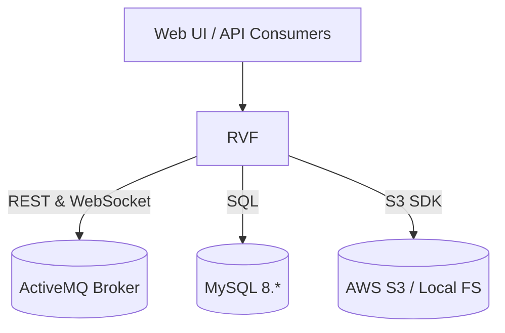
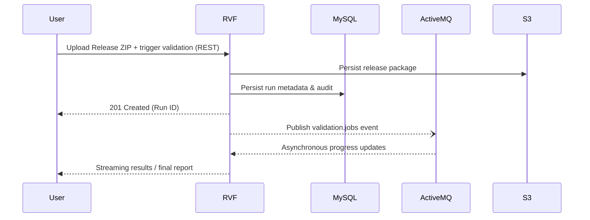

# SNOMED CT Release Validation Framework (RVF)

The **Release Validation Framework (RVF)** is a Spring Boot–based web application that executes automated quality-assurance assertions against prospective **SNOMED CT release packages**. It is used by the SNOMED International tooling ecosystem to gate both daily and production releases before publication.

RVF integrates with a rich set of backend systems—**MySQL 8** for scalable data-processing, **ActiveMQ** for asynchronous workflows, and cloud storage (e.g. **AWS S3**) for large release archives—while exposing a **REST / WebSocket API** (documented via Swagger-UI) through which UI clients and CI/CD pipelines can trigger and track validations.

> Looking for quick instructions? Jump straight to the [Docker Quick-Start guide](docs/using-docker.md) or the [Getting Started](docs/getting-started.md) tutorial.

---

## 1  High-Level Architecture



<br/>

#### Typical Validation Run



Key points:
* **Stateless** – session state lives in the DB or external services enabling horizontal scalability.
* **Liquibase** drives schema migrations; these run automatically on start-up.
* **Spring Scheduling, JMS & WebSocket** power asynchronous validation and client notifications.
* The application is packaged both as a fat **JAR** and a Debian **.deb** for production deployment under `supervisord`.

---

## 2  Feature Highlights

* **Interactive Swagger-UI / OpenAPI 3 docs** – [`App.java`](src/main/java/org/ihtsdo/rvf/App.java)
* **Assertion Execution Pipeline**
  * Core service – [`AssertionExecutionService`](src/main/java/org/ihtsdo/rvf/core/service/AssertionExecutionService.java)
  * Data loader – [`ReleaseFileDataLoader`](src/main/java/org/ihtsdo/rvf/core/service/ReleaseFileDataLoader.java)
  * Result extractor – [`MysqlFailuresExtractor`](src/main/java/org/ihtsdo/rvf/core/service/MysqlFailuresExtractor.java)
* **MySQL-backed dynamic schemas** – `RvfDynamicDataSource` spins up per-release schemas for massively-parallel processing.
* **JMS Messaging (ActiveMQ)** – configurable queue prefixes (`rvf.jms.queue.prefix`) enable multi-tenant deployments.
* **Module Storage & Resource Manager** – S3-backed storage for release and manifest files.
* **Database schema migrations with Liquibase** – [`create-tables-mysql.sql`](src/main/resources/sql/create-tables-mysql.sql)
* **Consul & Vault support** (optional) for distributed configuration and secrets management.

---

## 3  Project Layout

```
src/
  main/
    java/org/ihtsdo/rvf          ← Java sources
    resources/                   ← configuration, SQL scripts, Liquibase changelog
  test/                          ← unit & integration tests
```  
Package conventions:
* `config`             Spring `@Configuration` classes and beans.
* `rest`               Spring MVC controllers and DTOs.
* `core`               Business logic, services, entities & repositories.
* `importer`           CLI & helper utilities for assertion import.
* `structure`          Release-file abstractions and CSV helpers.
* `util`               General-purpose helpers.

Additional documentation:
* [Using the RVF API](docs/using-the-api.md)
* [Importing Assertions](docs/importing-assertions.md)
* [Configuration Guide](docs/configuration-guide.md)
* [Download Published Releases](docs/download-published-releases.md)

---

## 4  Getting Started Locally

### 4.1  Prerequisites

1. **JDK 17** (aligned with the parent BOM)
2. **Maven 3.8+** (wrapper provided)
3. **MySQL 8** running on `localhost:3306` with a database called `rvf`.
4. **ActiveMQ 5.x** (an embedded broker starts automatically for local dev, but external brokers are recommended for JMS testing).
5. (Optional) **AWS S3**, **Consul** & **Vault** if you want to mirror a production-like setup.

A ready-to-use `docker-compose.yml` is provided at the project root that starts MySQL and ActiveMQ.

### 4.2  Clone & Build

```bash
git clone https://github.com/IHTSDO/release-validation-framework.git
cd release-validation-framework
./mvnw clean verify
```
* `verify` runs the full test-suite and builds `target/release-validation-framework-${VERSION}.jar`.
* Run `./mvnw -Pdeb package` to also create `target/release-validation-framework-${VERSION}-all.deb`.

### 4.3  Configuration

1. Copy `src/main/resources/application.properties` → `src/main/resources/application-local.properties` (already `.gitignored`).
2. Override at least the following properties:
   ```properties
   spring.datasource.username=<your-db-user>
   spring.datasource.password=<your-db-pwd>
   rvf.environment.shortname=local
   rvf.jms.queue.prefix=local-rvf
   ```
3. Any property can also be supplied via environment variables, e.g. `SPRING_DATASOURCE_URL`.

### 4.4  Run

```bash
java -Xms512m -Xmx4g \
     -jar target/release-validation-framework-${VERSION}.jar \
     --server.port=8080 \
     --spring.config.additional-location=classpath:/,file:./ \
     --spring.profiles.active=local
```
Swagger UI will be available at <http://localhost:8080/swagger-ui/index.html>.

---

## 5  Messaging & Async Workflows

* JMS queues are prefixed using `rvf.jms.queue.prefix` for safe multi-tenant deployments.
* Payload sizes can be tuned via `activemq.max.message.concept-activities`.
* **Consumers must be idempotent** – messages may be redelivered when using ActiveMQ in fail-over mode.

---

## 6  Deployment

### 6.1  Fat JAR

```bash
java -Xms512m -Xmx4g \
     -Dspring.profiles.active=prod \
     -jar release-validation-framework-${VERSION}.jar
```

### 6.2  Debian package

1. `./mvnw -Pdeb package`
2. Copy the resulting `.deb` to your server.
3. ```bash
   sudo dpkg -i release-validation-framework-${VERSION}-all.deb
   sudo systemctl restart supervisor        # if applicable
   ```
   Configuration lives under `/opt/release-validation-framework/` and logs under `/var/log/rvf/`.

---
